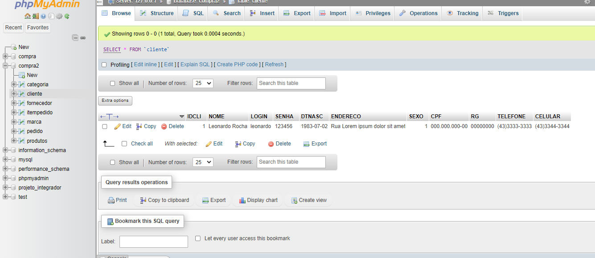
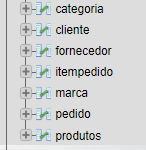
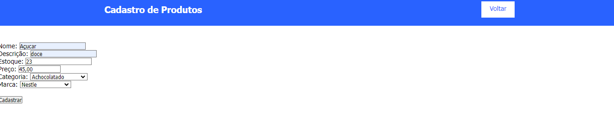
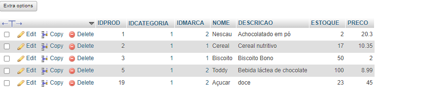

# CadEcommerce
# Índice
[Projeto ](#projeto)  
[Descrição](#descrição)  
[Estrutura do Projeto](#Estrutura-do-Projeto)  
[Funcionalidades](#funcionalidades)  
[Tecnologias ultilizadas](#tecnologias-ultilizadas)    
[Fontes consultadas](#fontes-consultadas)  
[Autores](#autores)  
[Contribuindo no GitHub](#Contribuindo-no-GitHub)  
 
# Projeto 
PHP e conexão de dados.
Este projeto tem como objetivo demonstrar a utilização da API ViaCEP para buscar informações de endereços a partir de CEPs fornecidos pelo usuário. Além disso, o projeto permite a criação de um carrinho de compras básico, com funcionalidades como:
 
* **Consulta de CEP:** Utiliza a API ViaCEP para obter informações detalhadas sobre um endereço, como logradouro, bairro, cidade e estado.
* **Adição ao carrinho:** Permite adicionar produtos ao carrinho de compras, com informações como nome, preço, quantidade e categoria.
* **Gerenciamento do carrinho:** Possibilita visualizar os itens adicionados ao carrinho, remover itens e realizar o cálculo do valor total da compra.
  
Disciplina:Programação Web I.  
Professor: Leonardo Santiago Sidon da Rocha.

## 📰Descrição
Este projeto simples utiliza a API ViaCEP para obter informações de endereço a partir do CEP (código postal) fornecido. Ele permite consultar facilmente as informações de domicílio por meio de uma interface. Além disso, possui funcionalidades para adicionar produtos ao carrinho, criar categorias, marcas, gerenciar estoque, definir valores e status dos produtos, e processar pedidos.
 
A tela inicial para a criação do carrinho 
 
    

 
 
 Quando adcionando no carrinho o tanto necessário:
  
 
    

 
 
  Sera adcionada a quantidade que o cliente acessou
 
   
 
 
Tabela de dados utilizados: 
 
   
  

E você tambem pode adcionar nova categoria, marca e produto
 
   
 
Banco de dados do produto utilizado como exemplo:
 
   
 

## Estrutura do Projeto
* **index.php:** Página principal do projeto, onde o usuário realiza a consulta de CEP e visualiza os produtos disponíveis. 
* **carrinho.php:** Página que exibe os itens adicionados ao carrinho e permite realizar o gerenciamento do mesmo. 
* **controller/produtos-busca.php:** Arquivo responsável por realizar a consulta à API ViaCEP e buscar as informações dos produtos. 
* **Produtos.class.php** O código define uma classe PHP chamada `Produtos` que contém métodos para gerenciar produtos, pedidos e clientes em um sistema de e-commerce, realizando operações como consultas SQL, inserções e manipulação de sessões. 
* **Cad/marca**  O código define uma classe PHP chamada `marca`. 
* ** Insere-marca.php/insere-produto.php/insere-categoria** código PHP insere uma nova categoria em um banco de dados com base em uma descrição fornecida via formulário, e exibe uma mensagem de sucesso ou erro. 
* **css/style.css:** Arquivo de estilo CSS para a página. 
* **js/jquery-2.1.4.min.js:** Biblioteca jQuery. 
* **js/script.js:** Arquivo JavaScript com a lógica da aplicação. 

 
### 📱Tecnologias utilizadas   
  PHP  
  
  JAVASCRIPT  
  
  HTML 
  
  CSS 
 

* **BANCO DE DADOS:** Criando o banco de dados para a obtenção de informações  
* **API ViaCEP:** Serviço web para consulta de CEPs.  

## ⚙️Funcionalidades

**Lista Geral**
 

Aqui está uma lista com uma frase explicativa para cada trecho de código:
 
1. **Página de Produtos (`index.php`):** 
   - Exibe a lista de produtos disponíveis, incluindo um link para o carrinho e a inclusão de um script PHP para buscar e mostrar produtos.

2. **Script de Adição ao Carrinho (`script.js`):** 
   - Adiciona uma funcionalidade para solicitar a quantidade de produtos ao usuário e redirecionar para a URL de adição ao carrinho com a quantidade especificada.

3. **Página do Carrinho (`carrinho.php`):** 
   - Mostra os produtos atualmente no carrinho, com um link de navegação para a página inicial e a inclusão de um script PHP para buscar e exibir itens do carrinho.

4. **Inserção de Nova Categoria, Marca e Produto:**
   - Recebe uma descrição via POST, insere uma nova categoria no banco de dados e exibe uma mensagem de sucesso ou erro com base na execução da consulta SQL.
   

5. **Conexão com o Banco de Dados (`conexao.php`):** 
   - Estabelece uma conexão com o banco de dados MySQL, configura o charset para UTF-8, e encerra o script se houver um erro de conexão.
    
 
 
  
   **Descrição dos Métodos Utilizados**
    

| Método                    | Descrição                                                                                       | Exemplo |
| ------------------------- | -------------------------------------------------------------------------------------------------| ------- |
| [**array()**](https://www.php.net/manual/pt_BR/function.array.php)               | Cria um array.                                                                                   | `$arr = array(1, 2, 3);` |
| [**array_keys()**](https://www.php.net/manual/pt_BR/function.array-keys.php)          | Retorna todas as chaves de um array.                                                             | `$keys = array_keys($arr);` |
| [**die()**](https://www.php.net/manual/pt_BR/function.die.php)                 | Termina a execução do script e opcionalmente imprime uma mensagem.                               | `die("Error: Cannot continue.");` |
| [**echo**](https://www.php.net/manual/pt_BR/function.echo.php)                  | Exibe uma ou mais strings.                                                                       | `echo "Hello, World!";` |
| [**exit;**](https://www.php.net/manual/pt_BR/function.exit.php)                 | Termina a execução do script.                                                                    | `exit("Script terminated.");` |
| [**header('Location:')**](https://www.php.net/manual/pt_BR/function.header.php)   | Envia um cabeçalho HTTP de redirecionamento para o navegador.                                    | `header('Location: index.php');` |
| [**include_once()**](https://www.php.net/manual/pt_BR/function.include-once.php)        | Inclui e avalia o arquivo especificado durante a execução do script, garantindo que ele seja incluído apenas uma vez. | `include_once('config.php');` |
| [**max()**](https://www.php.net/manual/pt_BR/function.max.php)                 | Retorna o valor máximo de um array ou de uma lista de argumentos.                                | `$maxValue = max(1, 2, 3);` |
| [**mysqli_affected_rows()**](https://www.php.net/manual/pt_BR/mysqli.affected-rows.php)| Retorna o número de linhas afetadas pela última consulta.                                        | `$affectedRows = mysqli_affected_rows($conn);` |
| [**mysqli_close()**](https://www.php.net/manual/pt_BR/mysqli.close.php)        | Fecha a conexão com o banco de dados MySQL.                                                      | `mysqli_close($conn);` |
| [**mysqli_connect()**](https://www.php.net/manual/pt_BR/mysqli.connect.php)      | Estabelece uma nova conexão com um servidor MySQL.                                                     | `$conn = mysqli_connect('localhost', 'user', 'password', 'database');` |
| [**mysqli_error()**](https://www.php.net/manual/pt_BR/mysqli.error.php)        | Retorna a mensagem de erro da última operação MySQL.                                             | `echo mysqli_error($conn);` |
| [**mysqli_fetch_assoc()**](https://www.php.net/manual/pt_BR/mysqli-result.fetch-assoc.php)  | Busca uma linha de resultado como um array associativo.                                        | `$row = mysqli_fetch_assoc($result);` |
| [**mysqli_fetch_object()**](https://www.php.net/manual/pt_BR/mysqli-result.fetch-object.php) | Busca uma linha de resultado como um objeto.                                                     | `$obj = mysqli_fetch_object($result);` |
| [**mysqli_query()**](https://www.php.net/manual/pt_BR/mysqli.query.php)        | Executa uma consulta no banco de dados MySQL.                                                    | `$result = mysqli_query($conn, "SELECT * FROM users");` |
| [**new Carrinho()**](https://www.php.net/manual/pt_BR/language.oop5.basic.php)        | Cria uma nova instância da classe `Carrinho`.                                                    | `$cart = new Carrinho();` |
| [**session_start()**](https://www.php.net/manual/pt_BR/function.session-start.php)       | Inicia uma nova sessão ou retoma uma sessão existente.                                           | `session_start();` |
| [**str_replace()**](https://www.php.net/manual/pt_BR/function.str-replace.php)         | Substitui todas as ocorrências de uma string por outra.                                          | `$newStr = str_replace("world", "PHP", "Hello world!");` |
| [**unset()**](https://www.php.net/manual/pt_BR/function.unset.php)               | Destrói a variável especificada, liberando qualquer recurso associado.                           | `unset($var);` |
| [**while**](https://www.php.net/manual/pt_BR/control-structures.while.php)                 | Estrutura de repetição que executa um bloco de código enquanto a condição for verdadeira.         | `while ($row = mysqli_fetch_assoc($result)) { echo $row['name']; }` |
| [**$mysqli->connect_error**](https://www.php.net/manual/pt_BR/mysqli.connect-error.php)| Propriedade que contém a mensagem de erro da última tentativa de conexão.                        | `if ($mysqli->connect_error) { die('Connect Error: ' . $mysqli->connect_error); }` |
| [**$mysqli->query**](https://www.php.net/manual/pt_BR/mysqli.query.php)        | Método orientado a objetos para executar uma consulta no banco de dados MySQL.                   | `$result = $mysqli->query("SELECT * FROM users");` |
| [**$mysqli->set_charset('utf8')**](https://www.php.net/manual/pt_BR/mysqli.set-charset.php) | Define o conjunto de caracteres da conexão MySQL para UTF-8.                                     | `$mysqli->set_charset('utf8');` |
| [**$_SESSION['']**](https://www.php.net/manual/pt_BR/reserved.variables.session.php)         | Superglobal que armazena e acessa variáveis de sessão.                                           | `$_SESSION['username'] = 'admin';` |
| [**__construct()**](https://www.php.net/manual/pt_BR/language.oop5.decon.php)         | Método construtor de uma classe, executado automaticamente na criação de um objeto.              | `class MyClass { function __construct() { echo "Constructor called"; } }` |
 ## ✒️Autores

 
Aluna:  
 
  Isabelle Nascimento de Oliveira  
 
* Professor Anderson Macedo 
* Professor Leonardo Santiago Sidon da Rocha.

## Contribuindo no GitHub

**Se você encontrou um problema, deseja sugerir melhorias ou simplesmente quer dar um feedback sobre o projeto, você pode contribuir fazendo um fork do repositório. Após fazer o fork, você pode:**

1. Fazer as modificações necessárias no seu repositório.
2. Enviar um pull request para o repositório original.

Agradeco sua contribuição!

